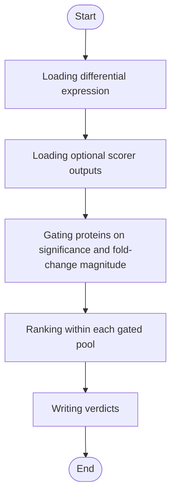

# Lyso-IP Gating & Ranking


## Installation

**[⬇️ Click here to install in Cauldron](http://localhost:50060/install?repo=https%3A%2F%2Fgithub.com%2Fnoatgnu%2Flysoip-gating-ranking-plugin)** _(requires Cauldron to be running)_

> **Repository**: `https://github.com/noatgnu/lysoip-gating-ranking-plugin`

**Manual installation:**

1. Open Cauldron
2. Go to **Plugins** → **Install from Repository**
3. Paste: `https://github.com/noatgnu/lysoip-gating-ranking-plugin`
4. Click **Install**

**ID**: `lysoip-gating-ranking`  
**Version**: 1.0.0  
**Category**: lysoip-qc  
**Author**: CauldronGO Team

## Description

Classifies proteins as Positive/Negative/Nonsignificant on hard significance gates, then z-score composite-ranks each gated pool


## Workflow Diagram



## Runtime

- **Environments**: `python`

- **Entrypoint**: `lysoip_gating_ranking.py`

## Inputs

| Name | Label | Type | Required | Default | Visibility |
|------|-------|------|----------|---------|------------|
| `differential_expression_file` | Differential Expression | file | Yes | - | Always visible |
| `reproducibility_file` | Reproducibility Scores | file | No | - | Always visible |
| `organelle_specificity_file` | Organelle Specificity Scores | file | No | - | Always visible |
| `go_evidence_file` | GO Evidence Scores | file | No | - | Always visible |
| `fold_change_min_abs_log2` | Minimum |log2 Fold Change| | number (min: 0, step: 0) | No | 0.585 | Always visible |
| `significance_alpha` | Significance Alpha | number (min: 0, max: 1, step: 0) | No | 0.05 | Always visible |
| `weight_fold_change` | Fold Change Weight | number (min: 0, step: 0) | No | 1 | Always visible |
| `weight_reproducibility` | Reproducibility Weight | number (min: 0, step: 0) | No | 1 | Always visible |
| `weight_organelle_specificity` | Organelle Specificity Weight | number (min: 0, step: 0) | No | 1 | Always visible |
| `weight_go_evidence` | GO Evidence Weight | number (min: 0, step: 0) | No | 1 | Always visible |

### Input Details

#### Differential Expression (`differential_expression_file`)

differential_expression.tsv from the Lyso-IP Differential Expression plugin (carries fold_change and significance)


#### Reproducibility Scores (`reproducibility_file`)

reproducibility.tsv from the Lyso-IP Reproducibility plugin


#### Organelle Specificity Scores (`organelle_specificity_file`)

organelle_specificity.tsv from the Lyso-IP Organelle Specificity plugin


#### GO Evidence Scores (`go_evidence_file`)

go_evidence.tsv from the Lyso-IP GO Evidence plugin


#### Minimum |log2 Fold Change| (`fold_change_min_abs_log2`)

A protein must clear this magnitude to gate as Positive/Negative


#### Significance Alpha (`significance_alpha`)

A protein must clear this adjusted p-value to gate as Positive/Negative


#### Fold Change Weight (`weight_fold_change`)


#### Reproducibility Weight (`weight_reproducibility`)


#### Organelle Specificity Weight (`weight_organelle_specificity`)


#### GO Evidence Weight (`weight_go_evidence`)


## Outputs

| Name | File | Type | Format | Description |
|------|------|------|--------|-------------|
| `verdict` | `verdict.tsv` | data | tsv | Per-protein classification (Positive/Negative/Nonsignificant) and composite ranking value within its gated pool |

## Requirements

- **Python Version**: >=3.11

### Package Dependencies (Inline)

Packages are defined inline in the plugin configuration:

- `pandas>=2.0.0`

> **Note**: When you create a custom environment for this plugin, these dependencies will be automatically installed.

## Example Data

This plugin includes example data for testing:

```yaml
  differential_expression_file: examples/differential_expression.tsv
  reproducibility_file: examples/reproducibility.tsv
```

Load example data by clicking the **Load Example** button in the UI.

## Usage

### Via UI

1. Navigate to **lysoip-qc** → **Lyso-IP Gating & Ranking**
2. Fill in the required inputs
3. Click **Run Analysis**

### Via Plugin System

```typescript
const jobId = await pluginService.executePlugin('lysoip-gating-ranking', {
  // Add parameters here
});
```
